# streamlit_xgboost
### 🎯 프로젝트 주제
본 프로젝트는 사용자의 인구통계학적 정보, 스마트폰 이용 행태, 미디어 소비 습관 등 다양한 설문 응답 데이터를 머신러닝 모델로 분석합니다.

이를 통해 개개인의 숨겨진 선호도를 파악하고, 가장 흥미를 느낄 만한 동영상 콘텐츠 카테고리 (예: 스포츠, 웹예능, 푸드, 뷰티 등)를 맞춤형으로 추천하는 것을 목표로 합니다.

---

<br/>

### ℹ️ 프로젝트 정보
수행 기관: 메타버스 아카데미
팀 명: P-TYPE
🗓️ 프로젝트 기간: 2025년 03월 31일 ~ 2025년 04월 04일
👥 팀원: 박정훈, 배성우, 임승환


---

<br/>

### 📊 사용 데이터
이 프로젝트는 방송통신위원회 방송통계포털에서 제공하는 데이터를 기반으로 합니다.

<br/>

데이터 명: 2022년 방송매체 이용행태 조사
데이터 출처: 방송통계포털 (mediastat.or.kr)
이 프로젝트는 방송통신위원회 방송통계포털에서 제공하는 데이터를 기반으로 합니다.

<br/>

데이터 명: 2022년 방송매체 이용행태 조사
데이터 출처: 방송통계포털 (mediastat.or.kr)

<br/>

---

### ⚙️ 모델 학습 알고리즘
사용자에게 하나 이상의 관련 동영상 카테고리를 추천하는 다중 레이블 분류(Multi-label Classification) 문제를 해결하기 위해 다음과 같은 알고리즘을 조합하여 사용했습니다.

<br/>

**기본 분류기: XGBClassifier (XGBoost)**

<br/>

XGBoost 자체는 기본적으로 다중 클래스 분류를 지원하지만, 다중 레이블 분류는 직접 지원하지 않습니다.
따라서 다중 레이블 분류를 위해 OneVsRestClassifier와 함께 사용했습니다.

<br/>

---

### 🛠️ 모델 최적화
모델의 성능을 향상시키기 위해 다음과 같은 최적화 과정을 수행했습니다.

<br/>

**1. 클래스 불균형 해소:**

다중 레이블 데이터셋에서는 특정 카테고리(레이블)를 선호하는 사용자가 다른 카테고리에 비해 매우 적거나 많을 수 있습니다 (클래스 불균형).
이러한 불균형은 모델이 소수 카테고리를 잘 예측하지 못하게 만들 수 있습니다.
XGBClassifier의 sample_weight="balanced" 옵션을 사용하여 학습 시 각 클래스(카테고리)의 중요도를 데이터 양에 반비례하도록 조정하여 불균형 문제를 완화하고자 했습니다.
```python
from sklearn.multiclass import OneVsRestClassifier
from xgboost import XGBClassifier

XGBmodel = OneVsRestClassifier(XGBClassifier(
    n_estimators=200, learning_rate=0.1, max_depth=5, random_state=42,
                                scale_pos_weight=... # 또는 scale_pos_weight 파라미터 활용
))
```

<br/>

**2. 하이퍼파라미터 튜닝 (Grid Search):**

모델의 성능은 n_estimators, learning_rate, max_depth 등 다양한 하이퍼파라미터 설정에 크게 영향을 받습니다.
GridSearchCV를 사용하여 미리 정의된 하이퍼파라미터 조합들을 교차 검증(Cross-Validation) 방식으로 평가하고, 가장 좋은 성능(여기서는 F1-Micro 점수 기준)을 내는 최적의 조합을 탐색했습니다.
OneVsRestClassifier와 함께 사용하기 위해 파라미터 이름 앞에 estimator__를 붙여 XGBoost 내부 파라미터를 지정했습니다.
```python
from sklearn.model_selection import GridSearchCV
from xgboost import XGBClassifier
from sklearn.multiclass import OneVsRestClassifier

# 탐색할 하이퍼파라미터 그리드 설정
param_grid = {
    'estimator__n_estimators': [300, 400, 500],
    'estimator__learning_rate': [0.05, 0.1, 0.2],
    'estimator__max_depth': [4, 5, 6],
    'estimator__min_child_weight': [1, 2, 3],
    'estimator__subsample': [0.75, 0.85, 0.95],
    'estimator__colsample_bytree': [0.7, 0.8, 0.9]
}

# GridSearchCV 설정 (OneVsRestClassifier 래핑)
base_model = OneVsRestClassifier(XGBClassifier(eval_metric='logloss', random_state=42))

grid_search = GridSearchCV(
    estimator=base_model,
    param_grid=param_grid,
    scoring='f1_micro', # 다중 레이블 평가지표
    cv=3, # 3-Fold 교차 검증
    verbose=2,
    n_jobs=-1 # 사용 가능한 모든 CPU 코어 사용
)
```

<br/>

---

### 📊 모델 성능 평가 (F1 Score)
모델이 각 동영상 카테고리를 얼마나 잘 예측하는지 평가하기 위해 F1 Score를 주요 지표로 활용했습니다.

**🤔 F1 Score란?**

모델의 정밀도(Precision)와 재현율(Recall)의 조화 평균(Harmonic Mean)입니다.
정밀도(Precision): 모델이 특정 카테고리라고 예측한 것 중, 실제로 해당 카테고리를 선호하는 사용자의 비율입니다. (예: 모델이 '스포츠'라고 추천했을 때, 실제로 사용자가 '스포츠'를 좋아할 확률) - 얼마나 정확하게 예측했는가?
재현율(Recall): 실제로 특정 카테고리를 선호하는 사용자 중, 모델이 해당 카테고리라고 예측한 사용자의 비율입니다. (예: 실제로 '스포츠'를 좋아하는 사용자 중, 모델이 '스포츠'라고 맞춘 확률) - 얼마나 빠짐없이 찾아냈는가?
F1 Score는 정밀도와 재현율이 모두 중요할 때 사용되며, 특히 데이터 불균형(어떤 카테고리는 인기가 많고 어떤 카테고리는 적은 경우)이 있을 때 유용합니다. 값이 1에 가까울수록 모델 성능이 좋음을 의미합니다.
아래 그래프는 학습된 모델이 각 동영상 카테고리별로 어느 정도의 F1 Score를 보이는지 시각화한 결과입니다. 이를 통해 어떤 카테고리를 상대적으로 잘 예측하고, 어떤 카테고리 예측에 어려움이 있는지 파악할 수 있습니다.

이러한 최적화 과정을 통해 모델의 일반화 성능과 예측 정확도를 높이고자 노력했습니다.

<br/>

---

## 프로젝트 개요
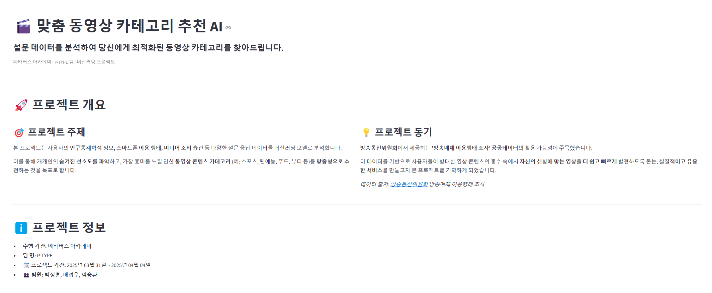
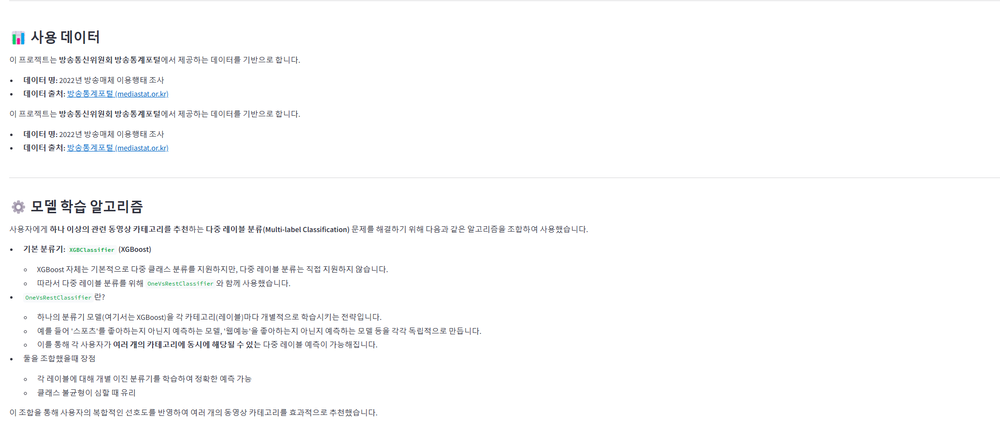
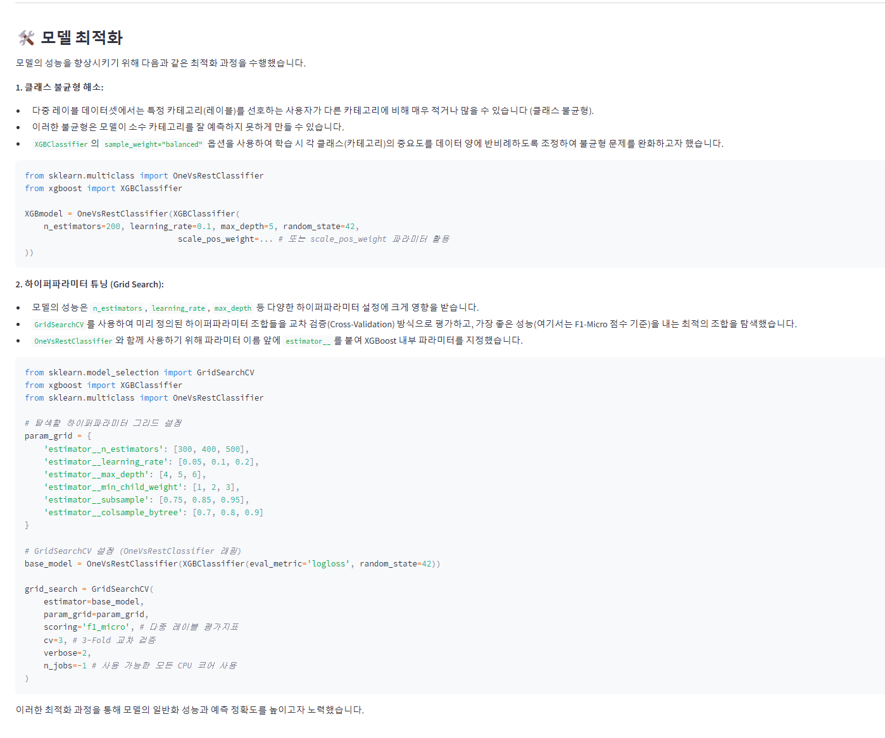
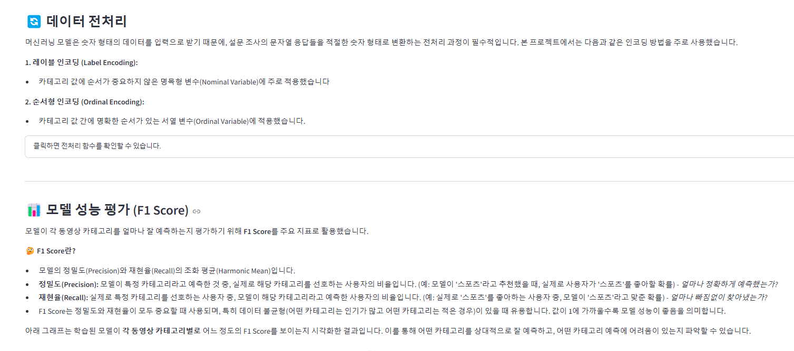
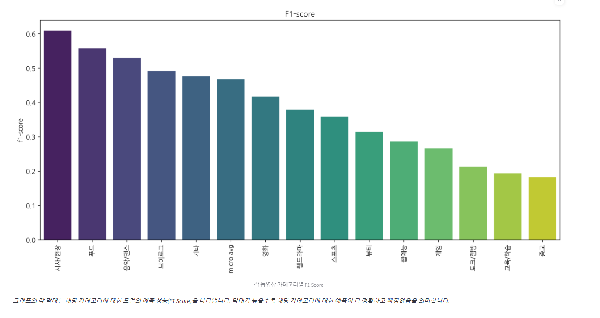

---

### **광고선호도 예측**
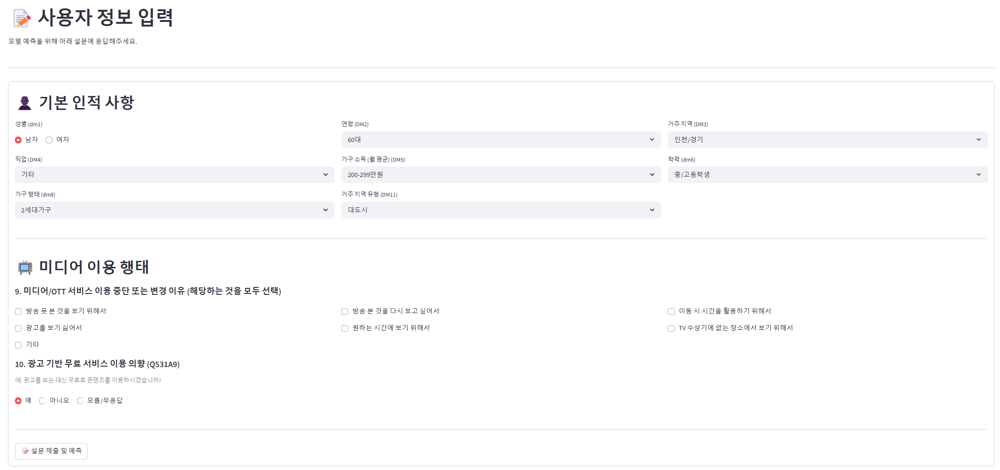
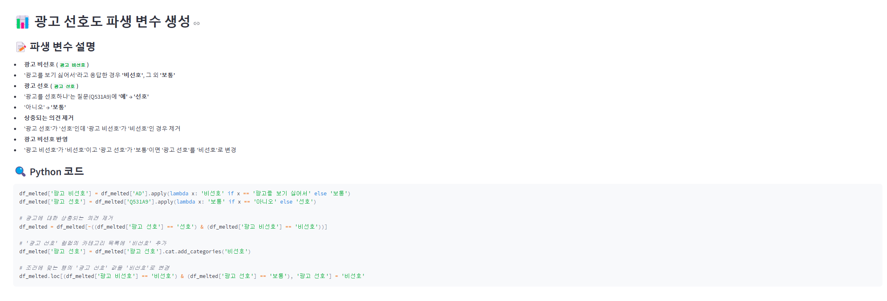
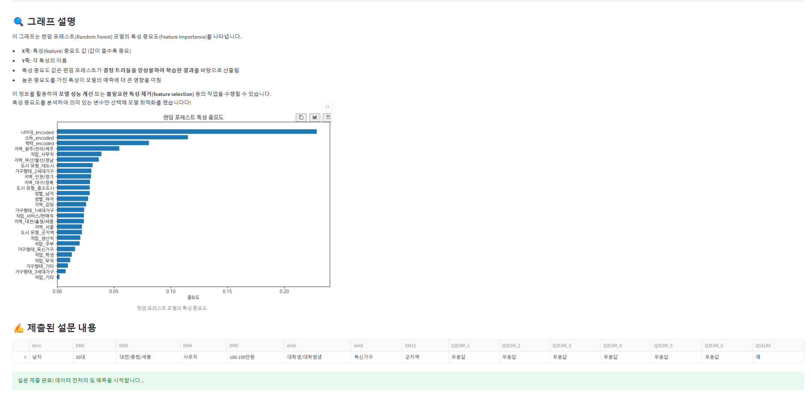
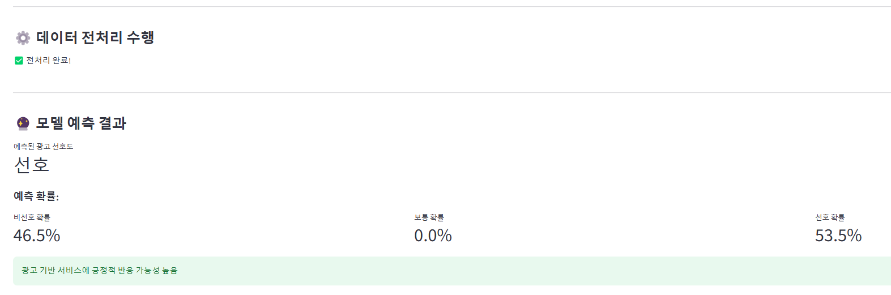

---

### **맞춤형 동영상 카테고리 추천**
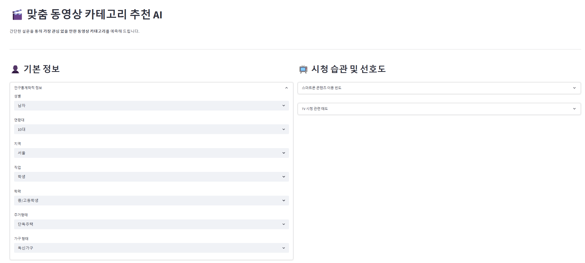
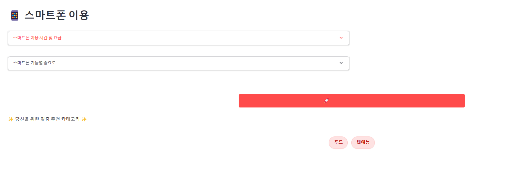

---
